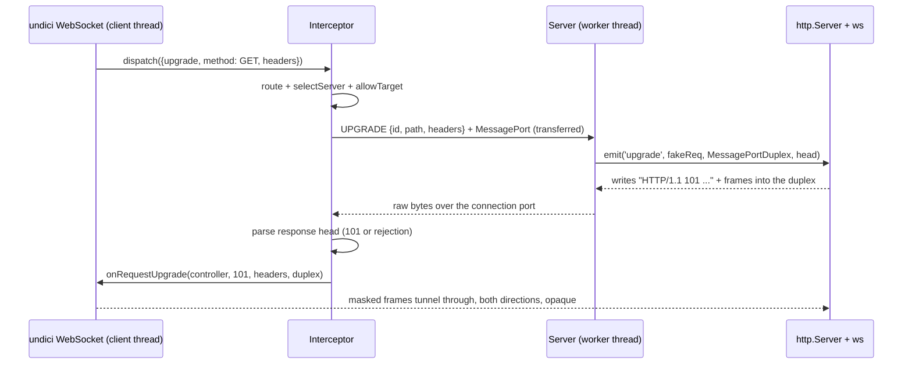

# PLAN: WebSocket Support

Status: brainstorm / design draft — not scheduled for implementation yet.

The v2 protocol plan (shipped in 2.0.0, see git history for the full
document) closed with this note:

> WebSocket and HTTP upgrade support is not part of the initial
> implementation. The protocol should remain compatible by keeping peer
> channels as control channels and using dedicated ports or direct handoff
> paths for future upgraded connections.

This document picks up from there.

## Goal

Allow a client in one thread to open a WebSocket connection to a mesh domain
(e.g. `ws://myserver.local/ws`) and have it served by a server registered
from another worker thread (or a TCP target), with the same routing semantics
as HTTP requests: domain matching, round-robin selection, `allowTarget`
hooks, pause/close lifecycle.

Target client is undici's `WebSocket` (and Node's global `WebSocket`), which
accepts a `dispatcher` option — so a composed interceptor is already in its
dispatch path. Target server APIs are `ws` (`WebSocketServer`),
`@fastify/websocket`, and anything else that consumes the Node
`http.Server` `'upgrade'` event.

## Why this is hard

Five structural problems, in decreasing order of pain:

1. **There is no socket.** Thread-mode requests never touch a socket: the
   interceptor serializes a `RequestMessage`, and `Server` services it with
   `light-my-request` `inject()`. A WebSocket upgrade *is* a socket
   takeover: undici's handler contract hands the caller a `Duplex`
   (`onRequestUpgrade(controller, statusCode, headers, socket)`), and `ws`
   on the server side writes its `101 Switching Protocols` response and all
   subsequent frames directly to a `Duplex`. We have to fabricate a socket
   on both sides and tunnel raw bytes between threads.

2. **`light-my-request` cannot do upgrades.** It simulates
   request/response only. The server side needs a completely separate path
   that emits `'upgrade'` on a real `http.Server` (or equivalent) with a
   fake `IncomingMessage` and our fake socket.

3. **The handshake response comes back as bytes, not as a message.** If we
   let the real server-side machinery (`ws.handleUpgrade`) perform the
   handshake — which we should, so `Sec-WebSocket-Accept`, subprotocol
   negotiation, extensions, and auth rejections all behave exactly like
   production — then the `101` (or a `400`/`404` rejection) arrives on the
   interceptor side as raw HTTP/1.1 bytes inside the tunnel. Undici's
   handler API wants `statusCode` + `headers` as structured arguments, so we
   need a minimal HTTP/1.1 response-head parser on the interceptor side.

4. **Connections are long-lived.** Everything in `Server` today assumes
   requests finish: `close()` drains the queue and `#activeRequests`, then
   resolves. A WebSocket can stay open for hours. Drain, pause, and
   mesh-removal semantics all need explicit decisions.

5. **Backpressure across threads.** The existing
   `MessagePortReadable`/`MessagePortWritable` pair is unidirectional with a
   credit (`more`) protocol. A socket is bidirectional; we need a
   `MessagePortDuplex` with flow control in both directions, or a fast
   producer floods the receiving thread's event loop.

## Options considered

### Option A — raw byte tunnel at the socket layer (recommended)

Treat the WebSocket connection as an opaque byte stream after routing.

- Interceptor: detect `opts.upgrade` in `dispatch()`, route/select the
  target as usual, open a dedicated `MessageChannel` for the connection,
  send a new `UPGRADE` message carrying method/path/headers plus the
  transferred port.
- Server: build a fake `IncomingMessage`-like request and a
  `MessagePortDuplex` socket, then
  `server.emit('upgrade', req, socket, head)`. `ws` performs the real
  handshake and speaks frames over our duplex.
- Interceptor: parse the response head out of the tunneled bytes. On `101`,
  call `handler.onRequestUpgrade(controller, 101, headers, duplex)` and go
  fully transparent — undici's WebSocket client does all frame
  encoding/decoding itself. On non-101, replay it as a normal response
  (`onResponseStart`/`onResponseData`/`onResponseEnd`) so handshake
  rejections surface exactly as undici would surface them from the network.

**Pros:** works with any server framework that hooks `'upgrade'`;
ping/pong, fragmentation, permessage-deflate, subprotocols, and close codes
work for free because we never interpret frames; behaves like a real
transparent proxy; TCP-mode targets come almost for free (see Option D).

**Cons:** per-frame copy + masking overhead (undici's client masks frames;
unavoidable at this layer); we own a tiny HTTP response-head parser; the
fake socket must be convincing enough for `ws` (a `Duplex` is officially
sufficient for `handleUpgrade`, but `setTimeout`/`setNoDelay`/
`remoteAddress` should be stubbed defensively).

### Option B — frame-level protocol (`WS_MESSAGE` / `WS_CLOSE` / `WS_PING`)

Define structured mesh messages per WebSocket event and re-encode on each
side. Could transfer `ArrayBuffer`s zero-copy and skip masking.

**Rejected:** impossible on the client side without replacing the client.
We intercept at the dispatcher layer, *below* undici's frame encoder — by
the time bytes reach us they are already masked frames. Frame-level events
would require shipping our own `WebSocket` class (Option C), and bypassing
`ws` internals on the server side. High effort, high incompatibility risk,
saves only the masking overhead.

### Option C — custom mesh-aware WebSocket client class

Export `createWebSocket(url, opts)` that speaks a message protocol directly
over `MessagePort`s, with no HTTP handshake at all.

**Rejected as the primary path:** breaks the core promise of the library —
that *unmodified* client code works against the mesh. Could be revisited
later as a zero-copy fast path, since Option A's protocol additions don't
preclude it.

### Option D — WebSocket only for TCP targets

Rewrite the origin to `server.address` and delegate the upgrade dispatch to
undici, which opens a real TCP connection.

**Not sufficient alone** (thread mode is the main use case), but it is
nearly free and ships as part of Option A: the TCP branch in `dispatch()`
already delegates with a rewritten origin; it only needs `HookHandler` to
forward `onRequestUpgrade` (one method, currently missing) and upgrade opts
passed through untouched.

**Decision: Option A, with Option D included as the TCP-mode branch.**

## Recommended architecture



### New components

1. **`MessagePortDuplex`** (`src/message-port-streams.ts`)
   Bidirectional stream over a single `MessagePort`, reusing the existing
   `StreamControl` wire shape (`chunks` / `more` / `fin` / `err`) — data
   flows in both directions, `more` grants read credit in both directions.
   Both ends are symmetric, so one class serves interceptor and server.
   Half-close matters: a received `fin` must end the readable side while
   the writable side stays open (`ws`'s close handshake relies on ordered
   FIN semantics).

2. **HTTP response-head parser** (`src/http-head-parser.ts`, interceptor
   side)
   Buffers tunneled bytes until `\r\n\r\n`, parses status line + headers,
   returns `{ statusCode, statusMessage, headers, rest }`. Roughly 60
   lines, no dependencies. Must tolerate the head split across chunks and
   frames coalesced into the same chunk as the head (`rest` is pushed back
   into the duplex before handing it to undici).

3. **Fake socket + fake request** (`src/fake-socket.ts`, server side)
   A `MessagePortDuplex` subclass (or wrapper) adding the socket-ish
   surface `ws` and user code touch: `setTimeout`, `setNoDelay`,
   `setKeepAlive`, `ref`/`unref` (no-ops), `remoteAddress`/`remotePort`/
   `localAddress` (synthetic, derived from mesh identity so logs stay
   useful), `destroySoon`. Plus a fake `IncomingMessage`: `method`, `url`,
   `headers`, `rawHeaders`, `httpVersion: '1.1'`, `socket`, `connection`.

### Protocol additions (`src/protocol.ts`)

```ts
UPGRADE: 'undici-thread-interceptor.upgrade'

interface UpgradeMessage {
  type: typeof Message.UPGRADE
  id: string
  meshId: string
  interceptorId: string
  origin: string
  path: string
  method: string            // GET in practice
  headers: Record<string, string | string[] | number | undefined>
  head?: Buffer             // bytes after the request head; empty for WS
  socketPort: MessagePort   // transferred; carries raw bytes both ways
}
```

No `UPGRADE_RESPONSE` message: the response travels *in-band* through
`socketPort` as raw HTTP bytes (problem 3). The server side stays trivially
simple — it never inspects what the upgrade handler writes. The existing
`ERROR { id }` reply remains for pre-handshake failures (no upgrade target,
server closed, synchronous throw) so the interceptor can fail fast with a
typed error instead of a dead socket. Success needs no reply at all — the
`101` bytes *are* the reply.

This matches the v2 plan's forward-compatibility note: the peer channel
stays a control channel; connection bytes ride a dedicated transferred port.

### Interceptor changes (`src/interceptor.ts`)

- `dispatch()`: when `opts.upgrade` is set and the origin matches the mesh,
  take the upgrade path. Reject `CONNECT` explicitly (out of scope).
  Routing, `onRequest` hooks, `allowTarget`, and `NoAvailableTargetError`
  semantics are unchanged and shared with the HTTP path.
- TCP targets: delegate with rewritten origin; add
  `HookHandler.onRequestUpgrade` forwarding.
- Thread targets: reuse `#ensurePeerMessagePort` for the control plane;
  create the per-connection `MessageChannel`; wrap port1 in
  `MessagePortDuplex` + head parser; transfer port2 inside
  `UpgradeMessage`.
- `connectTimeout` applies from `postMessage` until the response head is
  parsed. After `101`, the connection escapes the timeout machinery
  entirely.
- Track open tunnels per peer so `interceptor.close()` and peer-port
  `'close'` destroy them (destroying the duplex propagates `err`/`fin`
  through the port; the server side sees socket `'close'` and `ws` runs its
  normal close path).

### Server changes (`src/server.ts`)

- **Finding the upgrade target.** `#server` today can be a bare handler
  function, an `http.Server`, or something with `.inject()` (Fastify).
  Resolution order for the upgrade emitter:
  1. new explicit option `ServerOptions.upgrade?: (req, socket, head) =>
     void` — full control, always wins;
  2. `#server` is an `http.Server` (or any `EventEmitter` with `'upgrade'`
     listeners) → `emit('upgrade', ...)` on it;
  3. Fastify duck-typing: `#server.server` is an `http.Server` →
     `emit('upgrade', ...)` on it (what `@fastify/websocket` listens on);
  4. otherwise → reply in-band with `HTTP/1.1 501` bytes (see open
     questions).
- **Capability advertisement.** Add `capabilities?: { upgrade: boolean }`
  to `MeshServer`, computed at registration and on `replaceServer()`. Lets
  the interceptor skip non-capable targets *before* transferring a port,
  and gives `allowTarget` hooks something to route on in mixed meshes.
- **Lifecycle.**
  - Upgrades do **not** go through the request queue — it exists for
    fairness of short-lived work; parking a long-lived connection in it
    distorts both. They do respect `state`: paused/closing servers reject
    new upgrades (in-band `503`), matching HTTP semantics.
  - Track open sockets in a new `#activeSockets: Set<Duplex>`.
  - `close()` drains HTTP as today, then waits a grace period (new option
    `upgradeDrainTimeout`) for sockets to close naturally — well-behaved
    apps close their own WebSockets on shutdown — after which remaining
    sockets are destroyed.
  - `pause()` leaves established sockets alone, consistent with "paused
    servers remain in the mesh but are skipped by selection".

### Coordinator changes (`src/coordinator.ts`)

Almost none — the coordinator never sees connection traffic. Only the
`MeshServer.capabilities` field flows through mesh snapshots.

### Diagnostics (`src/diagnostics.ts`)

New channels mirroring the request ones: upgrade start / established (101)
/ rejected (non-101) / closed, on both interceptor and server sides.
Undici's own `websocket:*` client channels keep working untouched, since
the client code path is untouched.

## Edge cases to handle

- Non-101 handshake response (auth rejection, 404): replay as a normal
  HTTP response through the handler, then tear down the tunnel.
- Server writes `101` then immediately destroys (throw in the
  `'connection'` handler): `fin` after head → undici sees socket close →
  client gets close code 1006. Must not leak the interceptor's pending
  entry.
- Client aborts mid-handshake: controller abort → destroy duplex → `err`
  through the port → server-side socket `'close'`.
- Worker thread dies: peer port `'close'` already rejects pending
  requests; it must also destroy that peer's open tunnels.
- Backpressure both ways: slow client + fast server echo (and the inverse)
  must not grow unbounded buffers — the credit protocol covers it, but an
  explicit paused-reader test is required.
- `head` bytes are always empty for WebSocket clients, but the `'upgrade'`
  contract includes them; carry them through for correctness.
- Same-thread coordinator/server/interceptor via `sendThreadMessage()`:
  `MessageChannel` works in-thread; should just work, needs a test.
- Response head split across chunks, and frames coalesced with the head in
  one chunk.
- `permessage-deflate`: opaque to us, but test it — it changes chunk
  boundaries and sizes.

## Out of scope (initially)

- `CONNECT` tunnels and arbitrary non-WebSocket upgrades — the transport
  would likely work, but reject explicitly to keep the tested surface
  honest.
- HTTP/2 WebSocket (RFC 8441) — undici's client does not support it either.
- Frame-level zero-copy fast path (Option C follow-up).

## Testing plan (`test/websocket.test.ts` + fixtures)

Client: undici `WebSocket` over a composed `Agent`. Server fixtures: a
worker with `http.Server` + `ws`, and a Fastify + `@fastify/websocket`
variant. Both `ws` and `@fastify/websocket` become dev dependencies.

1. Echo: text, binary, empty, and >1 MiB messages (fragmentation +
   backpressure credits).
2. Close semantics: client- and server-initiated, custom code/reason
   round-trip; abnormal close (1006) when the worker is terminated.
3. Handshake rejection (400) surfaces as a client error, not a hang;
   `NoAvailableTargetError` when the origin has no available targets;
   absent domains delegate to undici untouched.
4. Routing: round-robin across two workers (count connections per worker);
   `allowTarget` steering on capability/metadata.
5. Lifecycle: pause blocks new upgrades but keeps established connections;
   `close()` grace drain; forced destroy after the timeout.
6. TCP-mode target end-to-end.
7. Same-thread mesh.
8. Ping/pong and permessage-deflate passthrough.
9. Diagnostics channel events.

## Suggested phasing

1. **Phase 0 — spike:** `MessagePortDuplex` + head parser + hardcoded
   wiring; one echo test green. De-risks problems 1, 3, and 5 before any
   API design lands.
   **Status: DONE** (`feat/websocket-phase0`). `MessagePortDuplex` and
   `toBufferChunk` live in `src/message-port-streams.ts`,
   `HttpResponseHeadParser` in `src/http-head-parser.ts`, and the
   hardcoded wiring + tests in `test/websocket-spike.test.ts`: echo (text,
   binary, 1 MiB), 100-message backpressure, close codes both directions,
   subprotocol negotiation, split/coalesced-head parsing.

### Phase 0 findings (constraints for phase 1)

- **undici 8's `WebSocket` rides on fetch**, not a bare dispatch:
  `lib/web/websocket/connection.js` calls `fetching()` with
  `mode: 'websocket'`, and fetch dispatches with
  `{ path, origin, method: 'GET', headers: <plain object>,
  upgrade: 'websocket', maxRedirections: 0 }`. The handler is new-style
  (`onRequestStart` / `onRequestUpgrade` / `onResponseError` …).
- **`controller.rawHeaders` is load-bearing.** Fetch's `onRequestUpgrade`
  builds its `HeadersList` from `controller?.rawHeaders ?? []`, and the
  `?? []` means the structured `headers` argument is *never* used
  (an empty array still takes the array branch). The interceptor's
  controller must expose the parsed head as flat `[name, value, ...]`
  Buffer pairs — `HttpResponseHeadParser` emits `rawHeaders` for this.
- **Fetch re-validates the handshake itself** (`Upgrade`, `Connection`,
  `Sec-WebSocket-Accept` hash, protocols, extensions), which confirms the
  in-band raw-bytes design: the server's genuine `101` must pass through
  unmodified; synthesizing a handshake response in the library would fail
  key validation.
- **`connection`/`upgrade` request headers are absent from dispatch opts**
  — undici's H1 client adds them at wire-write time. The server side must
  restore them before emitting `'upgrade'` or `ws` rejects the request
  (this also interacts with `sanitizeHeaders`, which strips `connection`).
- **`allowHalfOpen: false` is the right default** for `MessagePortDuplex`:
  ws/undici expect `net.Socket` semantics where receiving FIN auto-ends the
  write side; with half-open allowed, close handshakes leave the tunnel
  dangling.
- **Head parsing must happen before the duplex exists.** Attaching stream
  listeners for parsing and handing the stream over afterwards races with
  flowing-mode state; instead the interceptor consumes raw port messages
  (granting `{ more: true }` credits manually), then constructs the duplex,
  seeds it with `rest` + any remaining chunks, and hands it to
  `onRequestUpgrade` in the paused state — undici's microtask-later
  `'data'` listener starts the flow.
- Same-thread `MessageChannel` wiring is sufficient for all of this; no
  worker was needed to validate the mechanics (port transfer is phase 1).
2. **Phase 1:** `UPGRADE` protocol message, interceptor upgrade path,
   server upgrade-target resolution, TCP branch, error paths, bulk of the
   tests.
   **Status: DONE.** Landed: `UPGRADE` message with in-band handshake
   response over a transferred `socketPort` (`ERROR` retained for
   pre-handshake failures); interceptor upgrade dispatch sharing routing /
   `allowTarget` / `connectTimeout` with the HTTP path, non-101 replay as a
   regular response, per-peer tunnel tracking destroyed on close;
   `HookHandler.onRequestUpgrade` forwarding for TCP targets; server-side
   `src/fake-socket.ts` (fake socket + fake `IncomingMessage`),
   upgrade-emitter resolution (explicit `ServerOptions.upgrade` →
   `'upgrade'` listeners on the server → Fastify's `.server`), in-band
   `503`/`501` rejections (open question 4 resolved: in-band), and
   active-socket destruction on `close()` (immediate — grace period is
   phase 2). Upgrades bypass the request queue. `CONNECT` to mesh targets
   is rejected. Tests in `test/websocket.test.ts` cover echo, round-robin,
   rejection replay, paused targets, absent-domain delegation, TCP
   targets, 501/503, `connectTimeout`, same-thread mesh, hooks +
   `allowTarget`, server/interceptor close, and concurrent connections.
   Phase 1 note: a rejection duplex must `destroy()` itself after
   `'finish'` (like ws's `abortHandshake`) — with `allowHalfOpen: false`,
   finishing the writable alone leaves the port open and leaks the event
   loop handle.
3. **Phase 2:** lifecycle (drain/pause/force), capability flag + selection
   behavior, diagnostics, docs (README + MIGRATION note).
   **Status: DONE.** Landed: `upgradeDrainTimeout` (default 30000 ms, `0` =
   destroy immediately) — `close()` waits for established sockets to close
   naturally, then destroys the rest; `capabilities.upgrade` on
   `MeshServer` (computed as "can possibly upgrade": explicit handler,
   `'upgrade'`-capable emitter, Fastify `.server`, or TCP mode; recomputed
   on `replaceServer()`), with upgrade selection skipping non-capable
   targets; seven diagnostics channels
   (`upgrade:start/established/rejected/closed` interceptor-side,
   `server:upgrade:start/reject/closed` server-side); README WebSockets
   section + `ServerOptions` reference + MIGRATION note. Bonus fix:
   thread-mode HTTP requests to `http.Server`-registered targets now work
   (replayed through the server's `'request'` listeners, which
   `light-my-request` cannot inject into directly).

## Open questions — all resolved

1. **Selection vs capability:** RESOLVED — skip non-capable targets and
   keep scanning; `NoAvailableTargetError` only when no target can
   upgrade. Capability is computed optimistically ("can possibly
   upgrade"), so a capable target with no `'upgrade'` listener attached at
   request time still answers with an in-band `501`.
2. **Drain default:** RESOLVED — `upgradeDrainTimeout`, default 30000 ms,
   configurable, `0` destroys immediately after the HTTP drain.
3. **`ServerOptions.upgrade` handler option:** RESOLVED — shipped in
   phase 1.
4. **Non-upgradable target response:** RESOLVED — in-band (`503` for
   unavailable servers, `501` for non-upgradable targets); `ERROR` is
   reserved for transport-level failures.
5. **Established connections vs mesh changes:** RESOLVED — established
   sockets are never migrated or re-routed; mesh updates affect new
   connections only. Pause keeps established connections; `close()`
   drains them per (2); worker/peer/interceptor teardown destroys them.
