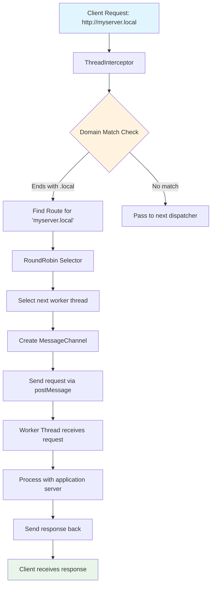
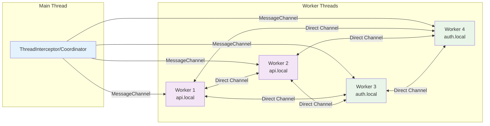

# undici-thread-interceptor

An Undici agent that routes requests to a worker thread.

Supports:

- load balancing (round robin)
- mesh networking between the worker threads
- load shedding (early request rejection)

## Installation

```bash
npm install undici undici-thread-interceptor
```

## Usage

### Main (main.js)

```javascript
import { Worker } from "node:worker_threads";
import { join } from "node:path";
import { createThreadInterceptor } from "undici-thread-interceptor";
import { Agent, request } from "undici";

const worker = new Worker(join(import.meta.dirname, "worker.js"));

const interceptor = createThreadInterceptor({
  domain: ".local", // The prefix for all local domains
});

await interceptor.route("myserver", worker); // This method is also aliased as addRoute

const agent = new Agent().compose(interceptor);

const { statusCode, body } = await request("http://myserver.local", {
  dispatcher: agent,
});

console.log(statusCode, await body.json());

// worker.terminate()
```

### Worker (worker.js)

#### Generic node HTTP application

```javascript
import { wire } from "undici-thread-interceptor";
import { parentPort } from "node:worker_threads";

function app(req, res) {
  res.writeHead(200, { "Content-Type": "application/json" });
  res.end(JSON.stringify({ hello: "world" }));
}

// App can optionally be a string in the form `http://HOST:PORT`. In that case the interceptor
// will use the network to perform the request.
wire({ server: app, port: parentPort });
```

#### Fastify

```javascript
import { wire } from "undici-thread-interceptor";
import { parentPort } from "node:worker_threads";
import fastify from "fastify";

const app = fastify();

app.get("/", (req, reply) => {
  reply.send({ hello: "world" });
});

wire({ server: app, port: parentPort });
```

#### Express

```javascript
import { wire } from "undici-thread-interceptor";
import { parentPort } from "node:worker_threads";
import express from "express";

const app = express();

app.get("/", (req, res) => {
  res.send({ hello: "world" });
});

wire({ server: app, port: parentPort });
```

#### Koa

```javascript
import { wire } from "undici-thread-interceptor";
import { parentPort } from "node:worker_threads";
import Koa from "koa";

const app = new Koa();

app.use((ctx) => {
  ctx.body = { hello: workerData?.message || "world" };
});

wire({ server: app.callback(), port: parentPort });
```

#### Replace the server at runtime

```javascript
import { wire } from "undici-thread-interceptor";
import { parentPort } from "node:worker_threads";
import fastify from "fastify";

const app1 = fastify();

app1.get("/", (req, reply) => {
  reply.send({ hello: "this is app 1" });
});

const app2 = fastify();

app2.get("/", (req, reply) => {
  reply.send({ hello: "this is app 2" });
});

const { replaceServer } = wire({ server: app1, port: parentPort });

setTimeout(() => {
  replaceServer(app2);
}, 5000);
```

#### Remove a thread from the mesh
```javascript
import { Worker } from "node:worker_threads";
import { join } from "node:path";
import { createThreadInterceptor } from "undici-thread-interceptor";
import { Agent, request } from "undici";

const worker = new Worker(join(import.meta.dirname, "worker.js"));

const interceptor = createThreadInterceptor({
  domain: ".local", // The prefix for all local domains
});

await interceptor.route("myserver", worker); // This method is also aliased as addRoute

// ...

await interceptor.unroute("myserver", worker); // This method is also aliased as removeRoute

// ...
```

#### Gracefully close the thread

If you want to gracefully close the worker thread, remember to call the `close` function of the interceptor.

```javascript
import { wire } from "undici-thread-interceptor";

// ...

const { interceptor } = wire({ server: app, port: parentPort });

// ...

await interceptor.close();
```

#### Gracefully close all the threads 

If you call the `close` method from the main thread, it will call the `close` function on each routed thread.

After calling the `close` method, each call to `route` will throw an error, unless you call the `restart` method first.

## How Routing Works

The undici-thread-interceptor implements a sophisticated routing system that distributes HTTP requests across multiple worker threads using domain-based routing and round-robin load balancing. Understanding how this system works will help you design more efficient multi-threaded applications.

### Core Architecture

The routing system consists of five main components working together:

1. **ThreadInterceptor** - The main entry point that creates and coordinates the entire system
2. **Interceptor** - Handles incoming requests and performs domain matching and routing decisions
3. **Coordinator** - Manages routes and orchestrates communication between threads via MessageChannels
4. **RoundRobin** - Implements load balancing to distribute requests evenly across available worker threads
5. **Wire** - Configures worker threads to receive and process incoming requests

### Request Flow

When a request is made to a hostname like `myserver.local`, here's the complete journey:



### Domain-Based Routing

The interceptor uses a configurable domain suffix to determine which requests to handle:

1. **Domain Configuration**: When creating the interceptor, you specify a domain like `.local`
2. **Hostname Matching**: For each request, the system extracts the hostname and checks if it ends with the configured domain
3. **Case-Insensitive**: Hostname matching is case-insensitive for reliability
4. **Fallback**: Requests that don't match the domain are passed to the next dispatcher in the chain

### Round-Robin Load Balancing

Each hostname can have multiple worker threads, and the system uses round-robin load balancing to distribute requests:

```javascript
// Multiple workers for the same hostname
await interceptor.route("api", worker1);
await interceptor.route("api", worker2);
await interceptor.route("api", worker3);

// Requests to api.local will be distributed:
// Request 1 -> worker1
// Request 2 -> worker2
// Request 3 -> worker3
// Request 4 -> worker1 (cycles back)
```

The RoundRobin class maintains an index that automatically advances with each request, ensuring even distribution across all available workers.

**Worker Readiness:** The round-robin selector only considers workers that are fully initialized and ready to handle requests. Workers signal their readiness after calling `wire()` and setting up their server. This prevents requests from being routed to workers that haven't finished initialization.

### Mesh Networking Between Workers

One of the most powerful features is the automatic mesh networking between worker threads. When you add routes, the coordinator automatically establishes communication channels between all workers:



### Inter-Thread Communication

The system uses Node.js MessageChannel for efficient communication:

1. **Request Serialization**: HTTP request details (method, path, headers, body) are serialized and sent via `postMessage`
2. **Stream Handling**: Large request/response bodies are transferred as MessagePort streams to avoid memory copying
3. **Response Routing**: Each request gets a unique ID to match responses back to the correct handler
4. **Error Handling**: Network errors and timeouts are properly propagated back to the client

### Dynamic Route Management

Routes can be added and removed dynamically during runtime:

```javascript
// Add a route
await interceptor.route("newservice", workerThread);

// Remove a specific worker from a route
await interceptor.unroute("newservice", workerThread);

// The mesh network automatically updates
// All other workers are notified of changes
```

When routes are modified:
1. The coordinator notifies all existing workers about the change
2. MessageChannels are established or torn down as needed
3. The mesh network maintains consistency across all threads

The `interceptor.route` method returns a promise that resolves when the worker is ready to handle requests.
The worker is considered ready when it has called `wire` or `replaceServer` with a non-null server value.

The `interceptor.unroute` method returns a promise that resolves when the worker is processed
all inflight requests and worker route is removed from all connected interceptors.

### Network Address Support

Workers can also proxy to network addresses instead of handling requests directly:

```javascript
// Route to a network service
wire({ server: "http://localhost:3001", port: parentPort });
```

When a worker is configured with a network address, requests are forwarded to that URL instead of being processed locally.

### Performance Characteristics

The routing system is designed for high performance:

- **Zero-Copy Streaming**: Large payloads use MessagePort transfers to avoid memory copying
- **Concurrent Processing**: Multiple workers can process requests simultaneously  
- **Efficient Load Balancing**: Round-robin is O(1) for worker selection
- **Asynchronous Communication**: All inter-thread communication is non-blocking

This architecture allows you to scale Node.js applications across multiple threads while maintaining the simplicity of HTTP-based communication patterns.

## API

### Load Shedding

Load shedding allows you to reject requests early, before they enter any worker queue. This is useful for preventing request pile-up during overload, allowing load balancers to route traffic elsewhere.

```javascript
import { createThreadInterceptor, LoadSheddingError } from "undici-thread-interceptor";

const interceptor = createThreadInterceptor({
  domain: ".local",
  canAccept: (ctx) => {
    // Return true to accept, false to reject
    return !isOverloaded(ctx.port);
  },
});
```

#### The `canAccept` Hook

The `canAccept` hook is called before routing a request to a worker. It receives a context object:

```javascript
{
  hostname: string,  // Target hostname (e.g., "api.local")
  method: string,    // HTTP method (e.g., "GET", "POST")
  path: string,      // Request path (e.g., "/users")
  headers: object,   // Request headers
  port: MessagePort, // The worker's MessagePort being checked
  meta: any,         // Metadata attached when routing (see below)
}
```

#### Worker Metadata

You can attach metadata to workers when routing to help identify them in `canAccept`:

```javascript
interceptor.route("api", worker1, { id: "worker-1", maxLoad: 100 });
interceptor.route("api", worker2, { id: "worker-2", maxLoad: 50 });
```

The metadata is available in the `canAccept` context as `ctx.meta`.

**With multiple workers**, the hook is called for each worker until one accepts:

```javascript
// Three workers for the same route
interceptor.route("api", worker1);
interceptor.route("api", worker2);
interceptor.route("api", worker3);

// Request arrives:
// 1. canAccept({ port: worker1, ... }) → false (busy)
// 2. canAccept({ port: worker2, ... }) → false (busy)
// 3. canAccept({ port: worker3, ... }) → true  → routes to worker3

// If all return false → LoadSheddingError (503)
```

#### LoadSheddingError

When all workers reject a request, a `LoadSheddingError` is thrown:

```javascript
import { LoadSheddingError } from "undici-thread-interceptor";

try {
  await request("http://api.local", { dispatcher: agent });
} catch (err) {
  if (err instanceof LoadSheddingError) {
    // err.statusCode === 503
    // err.code === 'UND_ERR_LOAD_SHEDDING'
    console.log("Service overloaded, try again later");
  }
}
```

#### Examples

**Memory-based shedding:**

```javascript
const interceptor = createThreadInterceptor({
  domain: ".local",
  canAccept: () => {
    const usage = process.memoryUsage();
    return usage.heapUsed / usage.heapTotal < 0.9; // Reject at 90% heap
  },
});
```

**Per-worker inflight tracking with metadata:**

```javascript
const workerLoad = new Map();

const interceptor = createThreadInterceptor({
  domain: ".local",
  canAccept: (ctx) => {
    const load = workerLoad.get(ctx.meta.id) ?? 0;
    return load < ctx.meta.maxLoad;
  },
});

interceptor.route("api", worker1, { id: "w1", maxLoad: 10 });
interceptor.route("api", worker2, { id: "w2", maxLoad: 20 });

// Update load counts externally (e.g., from metrics, hooks, etc.)
workerLoad.set("w1", 5);
workerLoad.set("w2", 15);
```

**Method-based shedding:**

```javascript
const interceptor = createThreadInterceptor({
  domain: ".local",
  canAccept: (ctx) => {
    // Always accept GET, shed POST/PUT under load
    if (ctx.method === "GET") return true;
    return !isOverloaded();
  },
});
```

### Hooks

It's possible to set some simple **synchronous** functions as hooks:

- `canAccept(ctx)` - See [Load Shedding](#load-shedding)
- `onChannelCreation(from, to)`
- `onServerRequest(req, cb)`
- `onServerResponse(req, res)`
- `onServerError(req, res, error)`
- `onClientRequest(req, clientCtx)`
- `onClientResponse(req, res, clientCtx)`
- `onClientResponseEnd(req, res, clientCtx)`
- `onClientError(req, res, clientCtx, error)`

The `clientCtx` is used to pass through hooks calls objects which cannot be set on request
(which is then sent through `postMessage`, so it might be not serializable).

#### `onChannelCreation` hook

The `onChannelCreation` hook is triggered when establishing communication channels between worker threads. It receives parameters `first` and `second` identifying the threads involved in the connection (in lower-case).

This hook implements access control by allowing you to prevent channel creation. If the hook returns `false`, channel establishment is blocked, remaining hooks are skipped, and the threads cannot communicate with each other. All other return values (including `undefined`) allow the channel to be created.

Use this hook to implement security policies and control which threads can communicate in your mesh network.

#### Client hooks

These are set on the agent dispatcher.

```javascript
const interceptor = createThreadInterceptor({
  domain: ".local",
  onClientRequest: (req) => console.log("onClientRequest called", req),
});
await interceptor.route("myserver", worker);

const agent = new Agent().compose(interceptor);

const { statusCode } = await request("http://myserver.local", {
  dispatcher: agent,
});
```

#### Server hooks

These can be passed to the `wire` function in workers. e.g. with Fastify:

```javascript
import { wire } from "undici-thread-interceptor";
import { parentPort } from "node:worker_threads";
import fastify from "fastify";

const app = fastify();

app.get("/", (req, reply) => {
  reply.send({ hello: "world" });
});

wire({
  server: app,
  port: parentPort,
  onServerRequest: (req, cb) => {
    console.log("onServerRequest called", req);
    cb();
  },
});
```

## License

MIT
